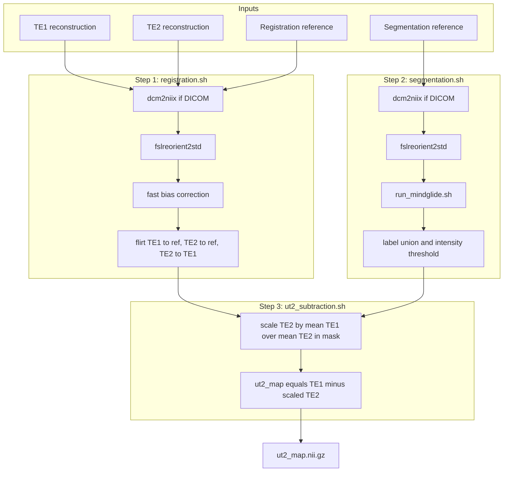

# UT2 Mapping Pipeline

This repository contains a Bash-based workflow for generating UT2 maps from the first and second echo images (TE1 and TE2) of a dual echo UTE sequence. The pipeline performs registration, segmentation, and final UT2 subtraction, with a batch wrapper for running multiple subjects.

## Pipeline flow


TE1/TE2 are expected to come from upstream UTE reconstruction (e.g. `UTERosette_bSSFP_dual_echo`).

## Overview of the scripts

### `config.sh`
Central configuration file for the pipeline. It is intended to be edited once after installation so the scripts know where to find FSL, ANTs, the MindGlide Apptainer image, and the MindGlide model bind mount.

Configured variables:
- `FSL_DIR`: path to FSL module
- `ANTS_DIR`: path to ANTs module
- `APPTAINER_IMAGE`: path to the MindGlide `.sif` image
- `MODEL_BIND`: bind mount for the MindGlide models directory

### `registration.sh`
Registers TE1 and TE2 to a shared registration reference image and then aligns TE2 into TE1 space for subtraction. It:
- accepts TE1, TE2, and a registration reference that can be either NIfTI or a DICOM directory
- registers the corrected TE1 and TE2 images to the reference with `flirt`
- registers TE2-in-reference-space to TE1-in-reference-space

### `run_mindglide.sh`
Runs the MindGlide segmentation model inside Apptainer on a single NIfTI image and writes a segmentation map. It:
- accepts one input image and one output file path
- binds the input directory, output directory, and model directory into the container
- calls MindGlide

### `segmentation.sh`
Builds the rescaling mask used in UT2 subtraction. It:
- accepts a segmentation reference image as NIfTI or DICOM
- runs `run_mindglide.sh` to generate a segmentation
- extracts one or more requested labels from the segmentation
- applies an upper-intensity threshold to the segmentation reference
- combines the label mask and threshold mask into `rescaling_mask_segmentation_ref.nii.gz`

The label list can be provided as comma-separated values or whitespace-separated values.

### `ut2_subtraction.sh`
Computes the final UT2 map. It:
- measures the mean TE1 and TE2 signal inside the rescaling mask
- calculates a TE2 scaling factor as `mean(TE1) / mean(TE2)` inside the mask
- saves the scaling factor to `te2_scaling_factor.txt`
- writes the rescaled TE2 image to `te2_rescaled.nii.gz`
- subtracts the rescaled TE2 image from TE1 to create `ut2_map.nii.gz`

### `run_ut2_pipeline.sh`
Runs the full single-subject workflow in order:
1. registration
2. segmentation mask creation
3. UT2 subtraction

It writes a `pipeline.log` file in the output directory and uses fixed settings for rescaling the TE2 image, defaults are:
- rescaling ROI label: `9`
- upper signal threshold in resclaing ROI: `9999`

### `run_ut2_pipeline_batch.sh`
Runs the single-subject pipeline for many subjects from a text file organized into blocks. Each subject block must contain exactly five non-empty lines:
1. TE1 image
2. TE2 image
3. registration reference
4. segmentation reference
5. output directory

Blank lines separate subjects. Lines beginning with `#` are treated as comments.

## Requirements

The scripts assume access to:
- Bash
- FSL
- ANTs
- `dcm2niix`
- Apptainer for MindGlide

## Configuring `config.sh`

Edit `config.sh` after installation so the pipeline points to the correct software locations on your system.

Example:
```bash
export FSL_DIR="SCS/fsl/fsl_latest"
export ANTS_DIR="SCS/ANTs/2.5.0"
export APPTAINER_IMAGE="/data/larson9/mindGlide/mindglide.sif"
export MODEL_BIND="/data/larson9/mindGlide/models:/models"
```

## Single-subject usage

Run the full pipeline with:
```bash
./run_ut2_pipeline.sh te1.nii.gz te2.nii.gz /path/to/reg_ref.nii.gz /path/to/seg_ref.nii.gz /path/to/output_dir
```

The registration and segmentation reference arguments can also be DICOM directories.

### Inputs
- `te1`: first echo image
- `te2`: second echo image
- `registration_ref`: reference image used to align TE1 and TE2 (currently using MP2RAGE INV2)
- `segmentation_ref`: reference image used to build the rescaling mask (currently using MP2RAGE UNI)
- `output_dir`: directory where all outputs will be written

### Main outputs
- `pipeline.log`
- `registration_ref.nii.gz`
- `te1_bfc.nii.gz`
- `te2_bfc.nii.gz`
- `te1_to_registration_ref.nii.gz`
- `te2_to_registration_ref.nii.gz`
- `te2_to_registration_ref_to_te1.nii.gz`
- `mindglide_mask_segmentation_ref.nii.gz`
- `rescaling_mask_segmentation_ref.nii.gz`
- `te2_scaling_factor.txt`
- `te2_rescaled.nii.gz`
- `ut2_map.nii.gz`

## Running scripts separately

You can also run each stage on its own:

### Registration only
```bash
./registration.sh te1.nii.gz te2.nii.gz /path/to/reg_ref.nii.gz /path/to/output_dir
```

### Segmentation mask only
```bash
./segmentation.sh /path/to/seg_ref.nii.gz "9" 9999 /path/to/output_dir
```

### UT2 subtraction only
```bash
./ut2_subtraction.sh \
  /path/to/output_dir/te1_to_registration_ref.nii.gz \
  /path/to/output_dir/te2_to_registration_ref_to_te1.nii.gz \
  /path/to/output_dir/rescaling_mask_segmentation_ref.nii.gz \
  /path/to/output_dir
```

### Batch mode
Create a text file with one 5-line block per subject and run:
```bash
./run_ut2_pipeline_batch.sh input_blocks.txt
```

Example block:
```text
/data/sub1/te1.nii.gz
/data/sub1/te2.nii.gz
/data/sub1/reg_ref
/data/sub1/seg_ref
/data/sub1/output
```
